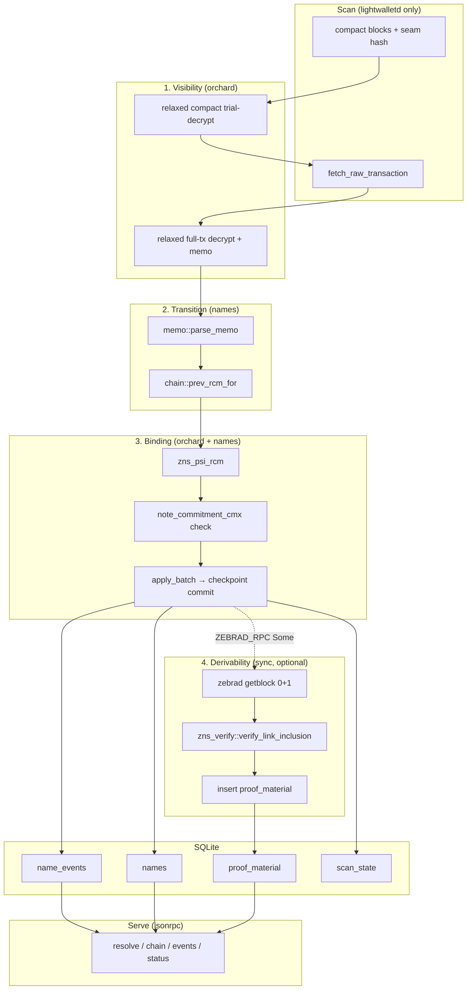

# ZNS resolver — ingest / index / serve

Trust model: **stale or omit, never forge.** Binding lives in `(ψ, rcm) → cmx`, not the memo.

Binary modules: `sync`, `orchard`, `names`, `jsonrpc` (no `lib.rs`). Proof I/O lives in `sync` (zebrad `getblock`), not a fifth module.

## Data sources

| Path | Source | Purpose |
|------|--------|---------|
| Index | lightwalletd (seer-sync) | Visibility, raw tx, transition, binding |
| Proofs | zebrad JSON-RPC (`ZEBRAD_RPC`, regtest e.g. `:18232`) | Full txid list + header + Merkle branch |

Proof material is **not** fetched from zcashd as a separate code path; RPC shape matches zebrad/regtest. With `ZEBRAD_RPC = None`, indexing and bare RPC answers work; `with_proof` / `chain` return `-32011`.

There is **no** LWD↔zebrad block-hash cross-check: height + inclusion under zebrad’s header is enough; wallets decide whether anchors are canonical (`PROOFS.md` §5 — restore from repo history or `zns-verify` `proof` module docs).

## Proof pipeline (after index)

1. `getblock(height, 1)` → txid list → `zns_verify::proof::merkle_branch`
2. `getblock(height, 0)` → parse/write header bytes
3. `verify_link_inclusion` on `(raw_tx, header, branch, index)` — skip row on failure (warn, no rewind)
4. `INSERT OR IGNORE` into `proof_material` (keyed by txid)

Reorg: shallow/deep `rewind` drops `proof_material` above fork like `name_events`.

## Design drift (resolved)

- **`pending_events`** — not implemented; events are applied inline in `apply_batch` inside one SQLite transaction.

## Related docs

- `AGENTS.md` — invariants
- `zns-verify` feature `proof` — wallet walk `verify_chain`; resolver uses `merkle_branch` + `verify_link_inclusion`