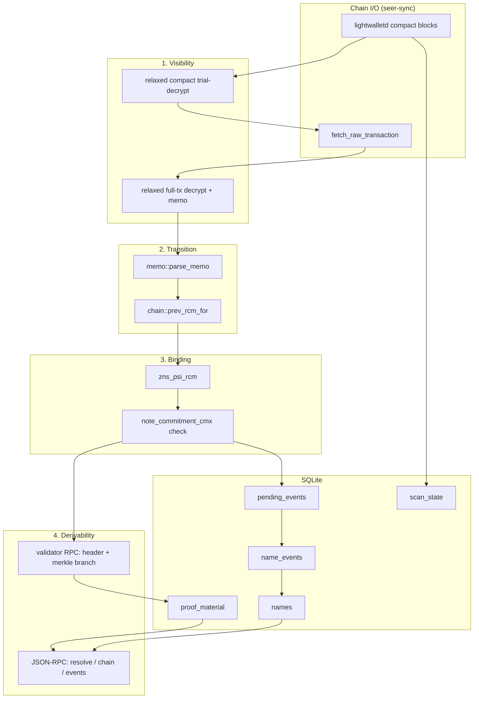

```mermaid
flowchart TB
    subgraph io ["Chain I/O (seer-sync)"]
        LWD[lightwalletd compact blocks]
        RAW[fetch_raw_transaction]
    end

    subgraph vis ["1. Visibility"]
        COMPACT[relaxed compact trial-decrypt]
        FULL[relaxed full-tx decrypt + memo]
    end

    subgraph trans ["2. Transition"]
        MEMO[memo::parse_memo]
        CHAIN[chain::prev_rcm_for]
    end

    subgraph bind ["3. Binding"]
        PSI[zns_psi_rcm]
        CMX[note_commitment_cmx check]
    end

    subgraph deriv ["4. Derivability"]
        PROOF[validator RPC: header + merkle branch]
        RPC[JSON-RPC: resolve / chain / events]
    end

    subgraph store ["SQLite"]
        PE[pending_events]
        NE[name_events]
        N[names]
        PM[proof_material]
        SS[scan_state]
    end

    LWD --> COMPACT
    COMPACT --> RAW
    RAW --> FULL
    FULL --> MEMO --> CHAIN --> PSI --> CMX
    CMX --> PE
    PE --> NE
    NE --> N
    CMX --> PROOF --> PM
    N --> RPC
    PM --> RPC
    LWD --> SS
```